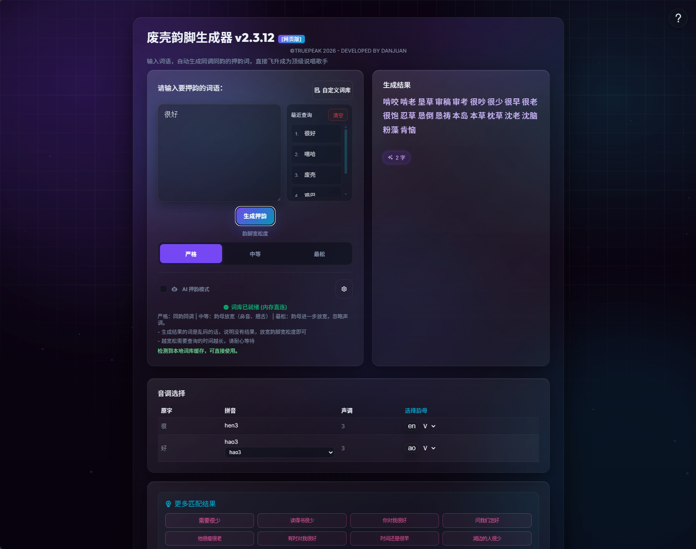

# 废壳韵脚生成器 - FakerRhymes

> **写词没有灵感？押韵不够带感？你需要这台灵感轰炸机！**

**废壳韵脚生成器 (FakerRhymes)** 是一款专为说唱歌手、词曲作者、写诗爱好者、创意文案人打造的中文韵脚生成网页工具。它能自动分析你输入的汉字，秒级提供海量押韵候选词。无论是工整的对仗，还是自由的双押、三押、多押，它都能带你起飞！

# 在线使用入口：**[fuckrapper.online](https://fuckrapper.online)**

### 备用网站：[Github](https://bajibaji.github.io/FakerRhymes/)

---

## 页面截图实测

---

## 核心硬核功能

### 1. 超级中文押韵词典 (2,088,975 词)
我们并行清洗并合并了 10 个大型语料库（包括新华成语、唐诗宋词、ACG萌娘热词、电影字幕、网络俚语等），总词汇量高达 208 万！是目前最全面、最硬核的中文押韵字库。

### 2. 歌词热词“淡粉色”高亮 + 优先排布
* **歌词灵感优先**：如果匹配出的词是来自海量经典说唱或流行歌词的词汇，生成器会为它们套上精美的淡粉色高亮皮肤，并自动优先排序在最前方。
* **双语兼容**：一击命中那些最能带起节奏的歌词热词！

### 3. 智能随机去重 (告别无用词刷屏)
我们加入了智能去重算法：在“更多匹配结果”中，如果是字数相同且结尾2个字一样的词（例如：“去极乐”、“到极乐”、“入极乐”），系统会自动随机保留其中一个展示。
这极大地拓宽了结果的多样性，把宝贵的显示区域留给更多不同意象的词汇！

### 4. 押韵盲区完美修复 (“油求辙”互押)
以前由于拼音编码缺失，像“九 (jiu)”、“流 (liu)”、“秋 (qiu)”、“求 (qiu)”等极其常用的字在押韵时会失效。新版本中，我们对词库进行了 100% 纯净规范化重构，现在它们能与“手 (shou)”、“口 (kou)”等油求辙字词完美互通押韵！

---

## 创作者的高级玩法

### 韵脚宽松度调节
* **严格 (0.0)**：声调完全一致，韵母完全相同（适合格律诗或完美强迫症）。
* **中等 (0.5)**：声调一致，韵母放宽。自动打通前鼻音与后鼻音（如 `an` 与 `ang`）、平舌与翘舌（如 `z` 与 `zh`）。
* **最松 (1.0)**：忽略声调限制，韵母极限放宽（适合说唱自由双押、多押）。

### 平仄过滤 (仅限“最松”模式)
* **全部**：展示所有声调结果。
* **平 (Ping)**：仅展示一声（阴平）和二声（阳平）的词。
* **仄 (Ze)**：仅展示三声（上声）和四声（去声）的词。
* *古风词作、对联创作的绝佳帮手！*

### AI 脑洞大开模式 (Gemini 联想)
嫌固定词库不够刺激？勾选 "AI 押韵模式"，在设置中填入你的 Gemini API Key。
AI 会打破词库边界，为你生成极具现代感、网络梗或意象化的脑洞押韵词！支持 HTTP/SOCKS 代理设置。

### 个人专属自定义词库
点击右上角“自定义词库”，录入你自己的口头禅、新造词或团队专属词，它们会立即保存到浏览器缓存中并参与到以后的押韵计算中！

---

## 快速上手 (三步起飞)

1. **载入词库**：首次打开，点击页面顶部的“加载词库”按钮（只需加载一次，下次使用自动离线秒开）。
2. **输入词语**：在“请输入要押韵的词语”中输入，例如“人工智能”，按 `Ctrl + Enter` 或点击“生成押韵”。
3. **调音台修正**：在结果下方会显示你输入的字的拼音和声调。如果遇到多音字（如“行”），只需在表格下拉菜单里改一下读音，系统会自动更新匹配结果！

---

## 常见问题 (FAQ)

**Q: 为什么输入词语后显示“没有找到结果”？**
A: 说明当前匹配太严格了，请尝试将“韵脚宽松度”滑块往右拖动调松，或者检查是否输入了过于生僻的字符。

**Q: 刚更新了代码，但是页面看起来没有变化，或者生成的词语里有杂乱的星号？**
A: 这是因为浏览器缓存了老版本的 main.js 或 Service Worker。请在页面上按下 **Ctrl + F5** 进行强刷，或者在控制台注销 Service Worker 缓存，即可正常加载最新的 **v2.3.12** 版本。

---

## 致谢与开发
* **数据来源**：清华大学开放中文词库、雾凇拼音词库、中华新华字典数据库。
* **核心算法**：基于 `pinyin-pro` 精准解析。
* **开发团队**：Developed by DANJUAN & Antigravity © 2026.

*Enjoy Rhyming! Let's get it!*
