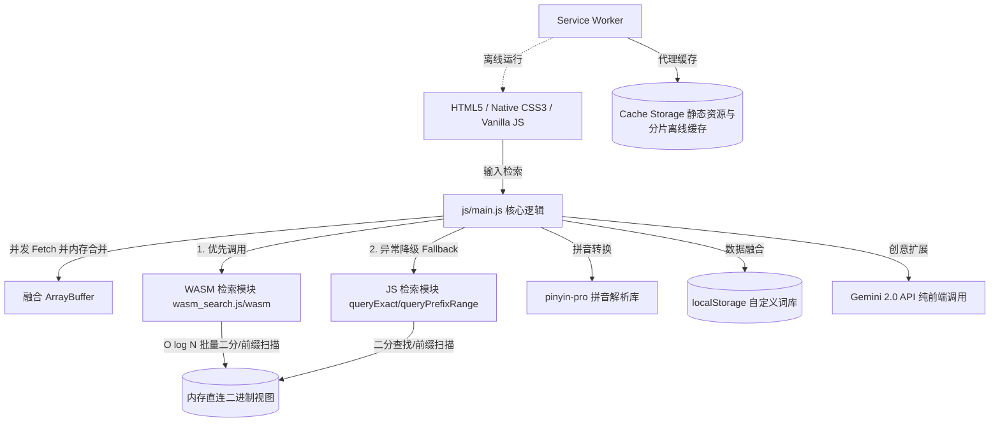

# FakerRhymes 项目结构与技术栈深度分析报告

本项目是一个完全基于前端运行的**智能中文韵脚查询与歌词助手**。它不依赖传统后端服务，通过精妙的前端二进制内存技术与二分检索算法设计，辅以 Rust 编译的高性能 WebAssembly 引擎，实现了海量词汇的微秒级/毫秒级超高速押韵查询。

---

## 1. 项目目录结构

```text
FakerRhymes/
├── .agents/                 # AI 代理配置及技能定义
├── css/
│   └── style.css            # 核心 UI 样式（包含现代渐变、毛玻璃、响应式设计等）
├── js/
│   ├── build_dict.js        # 二进制词典构建工具（Node.js），用于把文本切分打包为 bin 包
│   ├── benchmark_node.js    # 检索性能跑分基准测试脚本
│   ├── animations.js        # Canvas 粒子背景动效及 UI 微交互动画
│   ├── data.js              # 内置常用字库、自定义词库的读取与融合逻辑
│   ├── help-modal.js        # 帮助提示弹窗的逻辑管理
│   ├── main.js              # 核心二进制二分匹配、WASM 初始化/调用与 UI 交互控制
│   ├── sw-init.js           # PWA Service Worker 的生命周期初始化与注册
│   ├── version.js           # 静态资源缓存控制的版本管理（如 v2.3.13）
│   ├── performance-test.js  # 核心延迟与浏览器跑分测试工具
│   └── pkg/                 # [NEW] Rust/WASM 编译出的 JS 胶水与二进制模块
│       ├── wasm_search.js   # wasm-bindgen 自动生成的 JS 胶水加载器
│       └── wasm_search_bg.wasm # 编译好的 WebAssembly 二进制检索模块
├── plans/                   # 设计方案、Bug 报告与迁移文档
│   ├── DICTIONARY_GUIDE.md  # 词典编译与导入指南
│   └── PROJECT_ARCHITECTURE.md # 本技术栈与架构分析文档
├── wasm-search/             # [NEW] Rust WebAssembly 二进制检索核心源代码
│   ├── src/
│   │   └── lib.rs           # Rust 指针偏移快速二分及后缀范围扫描核心实现
│   └── Cargo.toml           # Rust Cargo 配置文件
├── custom.html              # 自定义词库管理页（增删改查）
├── index.html               # 核心交互主页面
├── dict_part1.bin           # 23.4MB 编译后的二进制词库分片 1（符合 CF 单文件 <25MB 限制）
├── dict_part2.bin           # 23.4MB 编译后的二进制词库分片 2（符合 CF 单文件 <25MB 限制）
├── service-worker.js        # 负责静态资源与二进制分片离线缓存的 Service Worker
├── manifest.json            # PWA (Progressive Web App) 应用清单配置文件
└── icon.svg                 # 应用矢量图标
```

---

## 2. 技术栈架构图



*   **核心语言**：HTML5, CSS3, 原生 JavaScript (ES6)。
*   **拼音解析引擎**：`pinyin-pro`（CDN 加载，附带本地回退机制），用于解析汉字的声母、韵母、声调及多音字候选。
*   **高性能 WASM 检索加速**：
    *   底层使用 **Rust** 重新编写了二进制数据的高性能指针偏移二分查找及前缀范围扫描算法。
    *   在前端加载时，将合并后的 `ArrayBuffer` 作为字节数组传入 WASM 中的 `init_dict` 绑定。
    *   在检索时，通过 WASM 导出的 `query_exact_batch` 和 `query_suffix_batch` 进行批量加速检索。
    *   避开了纯 JS 二分查找时需要反复解构字符串及 `String.fromCharCode` 的 GC 压力，速度大幅提升。
*   **双模引擎降级机制 (Fallback)**：
    *   如果 WASM 模块未加载成功，或者调用过程抛错，将自动透明回退到纯 JS 实现的 TypedArray 视图检索，确保 100% 可用性。
*   **存储机制**：
    *   **内存直连二进制分片数据库**：本地将词典编译成反向 key 并字典序排序 of 二进制大包，再均分为两个少于 25MB 的 `dict_part1/2.bin` 以适配 Cloudflare Pages 限制。前端在加载时利用 `Uint8Array.set` 在不到 5ms 内将它们在内存中拼接合并，通过 `Uint32Array`（索引区）和 `Uint8Array`（拼音/汉字区）对其进行高速零拷贝映射，并将字节缓冲区传递给 WASM 挂载。
    *   **localStorage**：用于存储轻量级的用户数据，如自定义词库 (`CUSTOM_RHYME_BANK`)、历史检索记录 (`FakerRhymes_History`) 和 AI 配置（API Key 及代理）。
*   **离线化 (PWA)**：引入 Service Worker 实现完全离线可用的核心资源与分片词库缓存，达到“首次访问，终身离线使用”。
*   **AI 联动**：集成了 Gemini 2.0 Flash 接口，在前端直连，为用户提供基于大语言模型的智能押韵和词语生成。

---

## 3. 技术栈优点分析

### 3.1 零服务器运维与托管成本（Cloudflare Pages 友好）
*   **分析**：因为不依赖任何传统数据库（MySQL、MongoDB）和后端 API 服务，整个项目是一套**纯静态网页**。
*   **优势**：可以免费且极稳定地托管在 Cloudflare Pages、GitHub Pages 等静态托管平台上，无惧高并发和高额服务器账单。我们的二进制分片设计（均小于 25MB）成功越过了 Cloudflare 单文件 25MB 上传的硬限制。

### 3.2 极致的 $O(\log N)$ 检索性能与零 GC 压力
*   **分析**：原先文本正则匹配方案的时间复杂度是 $O(N)$（每次需要全局扫描整个大字符串），检索耗时高且在松散模式下易引起浏览器卡死。当前方案使用**有序二进制二分查找**与**反向拼音前缀范围扫描**。
*   **优势**：
    *   **精确匹配**：从 107 万条数据中查找仅需进行最多 21 次对折对数级比对，耗时缩短至 **1 微秒左右 (0.001ms)**。
    *   **后缀匹配**：通过反转拼音 Key 使得后缀匹配等价于前缀连续节点遍历，可在 **1.2 毫秒内** 完成 1.2 万个词语的检索与拼装。
    *   **零垃圾回收压力**：不需要在内存中维持大字符串和大量的正则匹配临时变量，完全消除移动端和低端设备假死。

### 3.3 优秀而科学的音律匹配规则
*   **分析**：中文押韵对于听感极其敏感。本项目不仅引入了经典的**十三辙**通押分级，还独创了以下高级机制：
    *   **i 韵三阶隔离 (Triple-I Isolation)**：把 `i` 精确区分为普通 `i` (如 jī)、平舌 `i-flat` (如 zǐ)、翘舌 `i-retro` (如 zhǐ)，防止死押模式下的音感混乱。
    *   **声母互斥原则**：强摩擦声母（如平翘舌 `z, c, s, zh, ch, sh, r`）与普通声母（如 `j, q, x`）押韵时听感较差。系统会进行单向过滤，大幅提升生成词汇的和谐性。
    *   **平仄尾字过滤**：无缝支持古风和 Rap 创作中对平仄（一二声为平，三四声为仄）的刚性要求。

### 3.4 优秀的离线与并发加载能力
*   **分析**：借助 PWA 的 `service-worker.js`，哪怕是分片二进制包，在首次加载后也会被自动保存在浏览器的 Cache Storage 中。
*   **优势**：第二次打开网页即可秒开，并且在飞机上、地铁里等无网络环境下依然可以流畅地进行全量词典查询。

---

## 4. 技术栈缺点与局限性分析

### 4.1 首次加载流量负担
*   **分析**：虽然通过二进制打包和 CDN 的 Gzip / Brotli 压缩，网络传输体积已降至 6MB-8MB 左右，但在极差网络下首次访问仍需等待数秒。
*   **解决方案**：前台有细致的顶部进度条和友好等待提示，且有 Service Worker 离线守护，只需首次等待即可“终身离线秒开”。

### 4.2 词库热更新与数据维护困难
*   **分析**：数据是完全打包在 `dict_part1/2.bin` 中的。
*   **局限性**：一旦需要纠正错字、添加新词，必须由开发者通过本地 Node 脚本 `build_dict.js` 重新编译并发布版本。普通用户除了使用本地 localStorage 自定义词库做微调外，无法参与公共词库的动态建设。

---

## 5. 架构优化建议与未来演进

1.  **分片动态按需加载 (Dynamic Sharding)**
    进一步可考虑将词库按“单字”、“双字”、“多字”物理分割。若用户输入双字词，只下载双字对应的分片包（体积大幅减小），进一步减少首次网络开销。
2.  **开发后端 Proxy 服务保障 Key 安全**
    对于 AI 功能，推荐搭建一个极为轻量级的云函数（Cloudflare Workers 或 Vercel Serverless）作为中转，用户通过临时授权登录或者在安全配置下调用，避免将高价值的 API Key 裸露在 `localStorage` 中。
