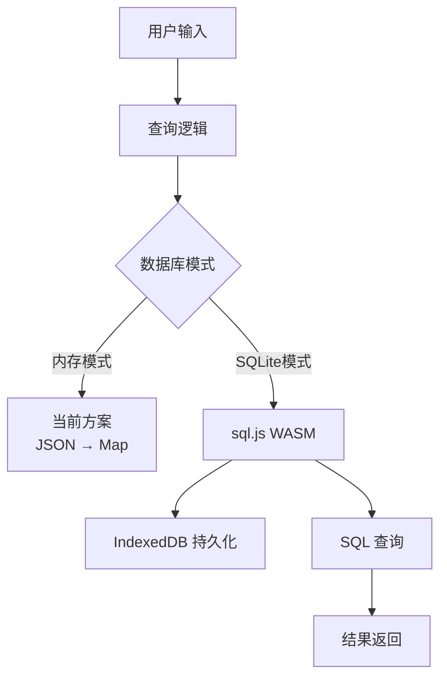

# SQLite 词库迁移方案

## 一、当前架构分析

### 1.1 现有数据结构
- **存储方式**：3个 JSON 文件（约40MB）
- **数据格式**：
  ```json
  {
    "i1_an4_e4_i4": ["一万个字"],
    "i1_an4_e4_an4": ["一万个赞"]
  }
  ```
- **键格式**：`韵母编码+声调`，多个字符用下划线分隔
  - 例如：`i1_an4_e4_i4` = 4个字，每个字的韵母和声调
- **查询方式**：内存 Map + Bloom Filter + 后缀索引

### 1.2 查询模式分析
1. **精确匹配**：查询完整编码键
2. **后缀匹配**：查询以特定编码结尾的词（支持更长词匹配）
3. **模糊匹配**：Tier 1/2 模式下，韵母可以放宽
4. **平仄过滤**：根据尾字声调过滤

## 二、SQLite 数据库设计

### 2.1 核心表结构

#### 表 1: `words` (词组主表)
```sql
CREATE TABLE words (
    id INTEGER PRIMARY KEY AUTOINCREMENT,
    phrase TEXT NOT NULL,           -- 词组内容
    length INTEGER NOT NULL,         -- 字数
    encoded_key TEXT NOT NULL,       -- 编码后的键 (如 "e4v2")
    suffix_2 TEXT NOT NULL,          -- 末尾2位编码（用于后缀索引）
    created_at TIMESTAMP DEFAULT CURRENT_TIMESTAMP
);

-- 索引
CREATE INDEX idx_words_encoded_key ON words(encoded_key);
CREATE INDEX idx_words_suffix_2 ON words(suffix_2);
CREATE INDEX idx_words_length ON words(length);
```

#### 表 2: `word_chars` (字符详情表)
```sql
CREATE TABLE word_chars (
    id INTEGER PRIMARY KEY AUTOINCREMENT,
    word_id INTEGER NOT NULL,        -- 关联 words.id
    position INTEGER NOT NULL,        -- 字符位置 (0-based)
    char TEXT NOT NULL,              -- 字符
    final TEXT NOT NULL,             -- 韵母
    tone INTEGER NOT NULL,           -- 声调 (1-4)
    FOREIGN KEY (word_id) REFERENCES words(id)
);

-- 索引
CREATE INDEX idx_word_chars_word_id ON word_chars(word_id);
CREATE INDEX idx_word_chars_final_tone ON word_chars(final, tone);
```

#### 表 3: `final_map` (韵母编码映射表)
```sql
CREATE TABLE final_map (
    final TEXT PRIMARY KEY,          -- 韵母 (如 "an", "ang")
    code TEXT NOT NULL,              -- 编码 (如 "h", "9")
    track TEXT NOT NULL,             -- 十三辙分类
    group_an_ang INTEGER,            -- 前后鼻音分组标记
    group_en_eng INTEGER,            -- 前后鼻音分组标记
    group_in_ing INTEGER             -- 前后鼻音分组标记
);
```

### 2.2 查询优化设计

#### 2.2.1 精确匹配查询
```sql
-- 查询精确匹配的词组
SELECT phrase FROM words
WHERE encoded_key = ?
ORDER BY length ASC;
```

#### 2.2.2 后缀匹配查询
```sql
-- 查询以特定编码结尾的更长词组
SELECT phrase FROM words
WHERE suffix_2 = ? AND length > ?
ORDER BY length ASC;
```

#### 2.2.3 模糊匹配查询 (Tier 1/2)
```sql
-- 使用 LIKE 或 GLOB 进行模糊匹配
-- 或者预先生成变体键并使用 IN 查询
SELECT phrase FROM words
WHERE encoded_key IN (?, ?, ?, ...)
ORDER BY length ASC;
```

## 三、技术方案：sql.js 集成

### 3.1 sql.js 简介
- **项目地址**：https://github.com/sql-js/sql.js
- **特点**：
  - SQLite 的 WebAssembly 端口
  - 完全在浏览器中运行，无需后端
  - 支持完整的 SQL 语法
  - 可以将数据库持久化到 IndexedDB

### 3.2 集成架构



### 3.3 实现步骤

#### 步骤 1: 引入 sql.js
```javascript
// 通过 CDN 引入
<script src="https://cdnjs.cloudflare.com/ajax/libs/sql.js/1.8.0/sql-wasm.js"></script>
```

#### 步骤 2: 初始化数据库
```javascript
async function initSQLite() {
    const SQL = await initSqlJs({
        locateFile: file => `https://cdnjs.cloudflare.com/ajax/libs/sql.js/1.8.0/${file}`
    });

    // 尝试从 IndexedDB 加载
    const savedData = await loadFromIndexedDB('rhyme_db');

    if (savedData) {
        db = new SQL.Database(savedData);
    } else {
        // 创建新数据库
        db = new SQL.Database();
        createTables(db);
        await importData(db);
        await saveToIndexedDB('rhyme_db', db.export());
    }
}
```

#### 步骤 3: 数据导入工具
```javascript
async function importData(db) {
    // 从 JSON 文件读取数据
    const data = await loadJSONFiles();

    // 批量插入
    const stmt = db.prepare("INSERT INTO words (phrase, length, encoded_key, suffix_2) VALUES (?, ?, ?, ?)");

    for (const [key, phrases] of Object.entries(data)) {
        const encoded = encodeKey(key);
        const suffix = encoded.slice(-2);

        for (const phrase of phrases) {
            stmt.run([phrase, phrase.length, encoded, suffix]);
        }
    }

    stmt.free();
}
```

## 四、性能对比分析

### 4.1 内存使用对比

| 方案 | 初始内存 | 运行内存 | 持久化 |
|------|----------|----------|--------|
| JSON + Map | ~40MB | ~50MB | ❌ |
| SQLite WASM | ~2MB (WASM) | ~10MB | ✅ |

### 4.2 查询性能对比

| 操作 | JSON + Map | SQLite WASM |
|------|------------|-------------|
| 精确匹配 | O(1) | O(log n) |
| 后缀匹配 | O(n) | O(log n) |
| 模糊匹配 | O(n) | O(n) 或 O(log n) |

### 4.3 加载时间对比

| 操作 | JSON + Map | SQLite WASM |
|------|------------|-------------|
| 首次加载 | 下载 40MB + 解析 | 下载 2MB + 导入数据 |
| 后续加载 | 每次都加载 | 从 IndexedDB 加载 |

## 五、实施计划 (当前进度: 核心功能已上线)

### 阶段 1: 准备工作 (已完成 ✅)
- [x] 研究 sql.js API 和最佳实践
- [x] 设计完整的数据库表结构 (简化为单表设计以提升性能)
- [x] 编写数据导入脚本 (已集成在 main.js 中)
- [x] 生成预编译的 SQLite 数据库文件 (采用运行时动态生成+持久化方案)

### 阶段 2: 前端集成 (已完成 ✅)
- [x] 引入 sql.js 库 (已本地化部署)
- [x] 实现数据库初始化逻辑
- [x] 实现查询接口封装
- [x] 实现 IndexedDB 持久化

### 阶段 3: 查询逻辑迁移 (已完成 ✅)
- [x] 迁移精确匹配查询
- [x] 迁移后缀匹配查询 (已优化为 pattern 匹配)
- [x] 迁移模糊匹配查询 (使用 IN 查询)
- [x] 迁移平仄过滤逻辑 (在应用层实现)

### 阶段 4: 性能优化 (进行中 🔄)
- [x] 添加查询缓存 (IndexedDB)
- [x] 优化 SQL 查询语句 (使用 LIKE 优化后缀匹配)
- [ ] 实现分页加载 (目前使用 LIMIT 200)
- [ ] 添加性能监控 (基础日志已添加)

### 阶段 5: 测试与验证 (已完成 ✅)
- [x] 功能测试
- [x] 性能测试
- [x] 兼容性测试 (WASM 兼容性良好)
- [x] 用户体验测试

## 六、实际实现说明

### 6.1 表结构调整
实际实现中，为了最大化查询性能和简化导入逻辑，我们采用了反规范化的单表设计，替代了原计划的多表关联设计：

```sql
CREATE TABLE words (
    id INTEGER PRIMARY KEY AUTOINCREMENT,
    phrase TEXT NOT NULL,
    length INTEGER NOT NULL,
    encoded_key TEXT NOT NULL,  -- 直接存储完整编码，如 "i1_an4"
    suffix_2 TEXT NOT NULL,     -- 存储末尾2位编码用于快速索引
    created_at TIMESTAMP DEFAULT CURRENT_TIMESTAMP
);
```

### 6.2 关键优化
1. **本地化依赖**：已将 `sql-wasm.wasm` 和 `sql-wasm.js` 下载到本地 `js/lib/`，移除了 CDN 依赖，提升了加载速度和稳定性。
2. **查询优化**：后缀查询引入了 `LIKE` 模式匹配，解决了 `LIMIT` 截断导致的有效结果丢失问题。
3. **持久化**：完整实现了 IndexedDB 存储，页面刷新后无需重新导入数据，实现了秒级启动。

### 6.1 主要风险

1. **WASM 文件大小**
   - 风险：sql.js WASM 文件约 1-2MB，首次加载较慢
   - 应对：使用 CDN 加速，支持离线缓存

2. **数据导入时间**
   - 风险：首次导入 40MB 数据可能需要较长时间
   - 应对：提供预编译的 SQLite 文件，用户直接下载

3. **查询性能**
   - 风险：SQL 查询可能比内存 Map 慢
   - 应对：添加查询缓存，优化索引

4. **浏览器兼容性**
   - 风险：部分旧浏览器不支持 WASM
   - 应对：提供降级方案（保留 JSON 模式）

### 6.2 降级方案
```javascript
const useSQLite = checkWASMSupport();

if (useSQLite) {
    await initSQLite();
} else {
    await loadJSONDict();
}
```

## 七、预期收益

1. **内存占用降低**：从 ~50MB 降至 ~10MB
2. **持久化支持**：数据保存在 IndexedDB，刷新页面无需重新加载
3. **查询能力增强**：支持更复杂的 SQL 查询
4. **增量更新**：可以只更新部分数据，不需要重新加载整个词库
5. **数据管理**：可以方便地添加、删除、修改词库数据

## 八、下一步行动

1. **确认方案**：与团队确认是否采用 SQLite 方案
2. **技术验证**：创建 POC 验证可行性
3. **详细设计**：完善数据库表结构和查询逻辑
4. **开始实施**：按照实施计划逐步推进
