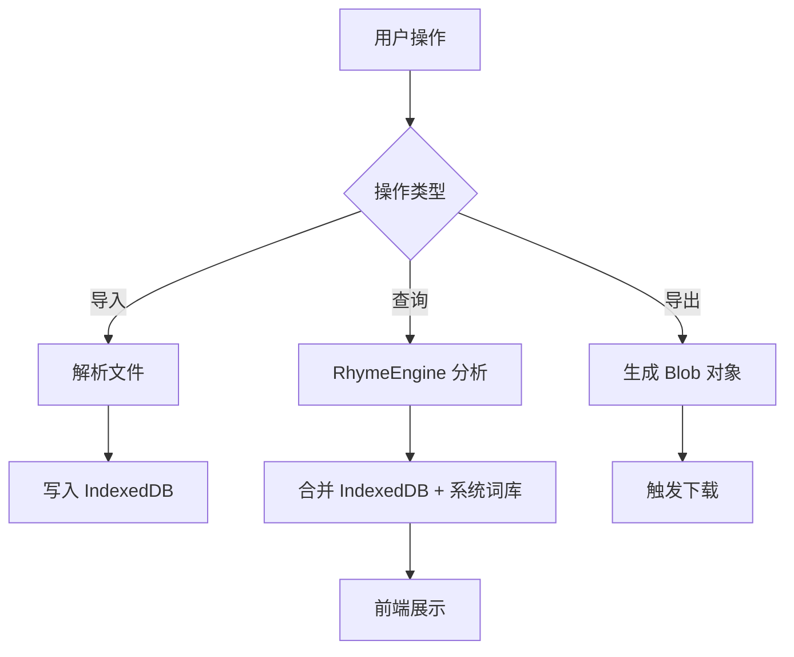

# 自定义词库优化技术方案

## 1. 现状分析 (Pain Points)
- **存储受限**: 使用 `localStorage`，上限约 5MB，且存取大型 JSON 会阻塞主线程。
- **查询效率低**: 每次查询都通过 `localStorage.getItem` 并 `JSON.parse` 整个词库，且在循环中进行拼音转换。
- **匹配单一**: 仅支持简单的末尾两个字匹配，无法处理更长或更复杂的押韵需求。
- **交互简陋**: 无法搜索、批量管理或对自定义词进行分类/打标。

## 2. 核心架构改进

### 2.1 存储升级：IndexedDB
将自定义词库移至 IndexedDB，使用 `idb` 轻量库或原生 API。
- **Store 结构**: `phrases` { word: string, tags: array, timestamp: number, weight: number }
- **优势**: 异步操作、容量大、支持索引查询。

### 2.2 查询引擎优化 (`dict-manager.js`)
- **预热缓存**: 启动时将自定义词库异步加载到内存中的 `Map` 或 `Trie` 树中。
- **优先级机制**: 在结果返回中，将自定义词库的匹配项置顶，并标记特殊样式（如“自定义”标签）。
- **多级匹配**:
    - 全词拼音索引匹配。
    - 支持按字数降级匹配（已初步实现，需增强）。

### 2.3 UI/UX 升级 (`custom.html`)
- **列表管理**: 引入虚拟列表（如果词量大），支持搜索过滤。
- **批量导入**: 支持 `.txt`, `.csv` 拖拽导入。
- **标签系统**: 支持给词语打标（如：地名、人物、脏话等），在主页搜索时可过滤。

### 2.4 导入导出增强
- **导出功能**: 允许用户导出为标准的 `JSON`（包含元数据）或纯文本 `TXT`（每行一个词）。
- **导入功能**: 支持拖拽上传，自动解析内容并去重合并到 IndexedDB。
- **文件格式支持**: `.json`, `.txt`, `.csv`。

## 3. 流程设计 (Mermaid)

## 4. 后续任务分配
- **存储层**: 创建 `scripts/db.js` 处理 IndexedDB 逻辑。
- **逻辑层**: 修改 `scripts/dict-manager.js` 接入 `db.js`。
- **文件处理**: 在 `custom.html` 或新脚本中实现 `File API` 读写。
- **视图层**: 重写 `custom.html` 样式与交互逻辑。

---
**当前消耗次数：6次 | 目标次数：15次 | 消耗金额：0.042元**
