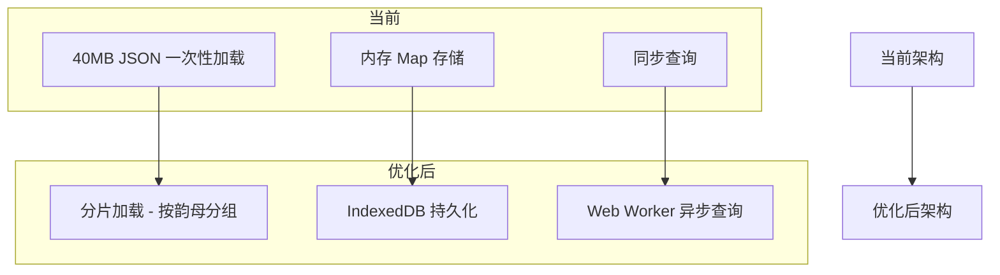
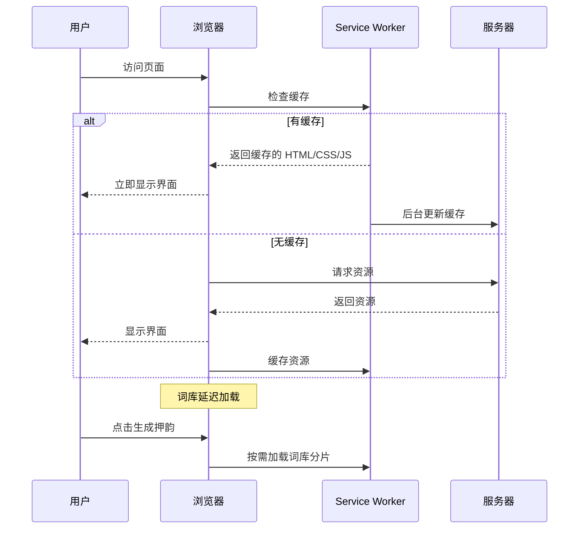
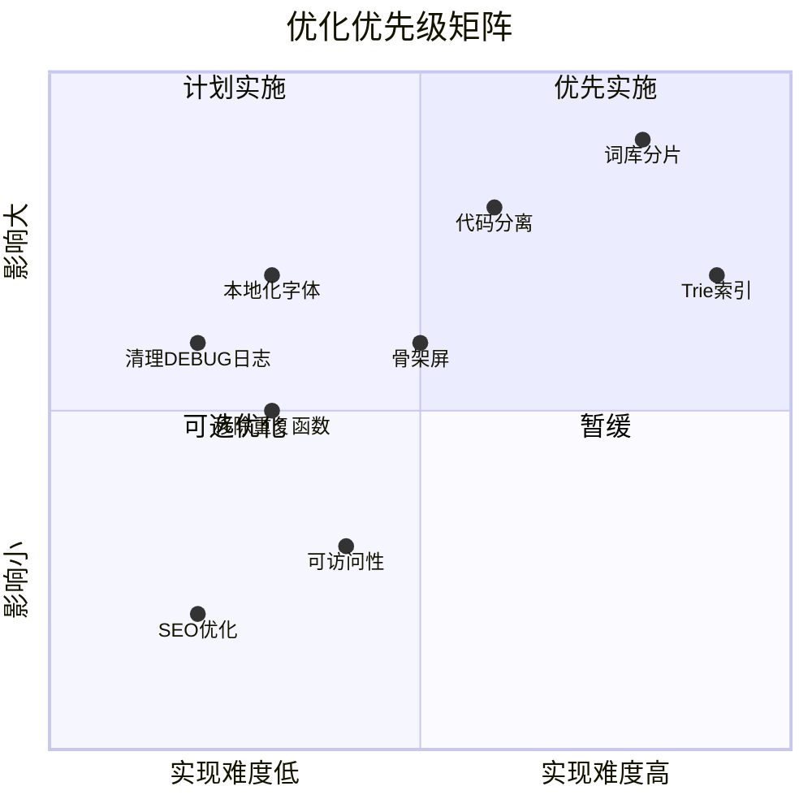

# 废壳韵脚生成器 - 优化方案

## 项目概述

**FakerRhymes** 是一款中文押韵生成器，基于纯前端技术栈（HTML/CSS/JavaScript），支持 PWA 离线使用和 AI 辅助押韵。

---

## 🔴 高优先级优化

### 1. 性能优化 - 词库加载与查询

#### 问题分析

| 问题 | 位置 | 影响 |
|------|------|------|
| 词库文件过大 | `dict_optimized.json` ~40MB | 首次加载慢，移动端体验差 |
| 重复的 `getFromDB()` 函数定义 | [`index.html:1521-1529`](index.html:1521) 和 [`index.html:1701-1708`](index.html:1701) | 代码冗余，维护困难 |
| 大量 DEBUG 日志未清理 | [`index.html:1931-1940`](index.html:1931) | 生产环境性能损耗 |
| `queryDict()` 中存在 O(n) 遍历 | [`index.html:1860-1981`](index.html:1860) | 大词库查询慢 |

#### 优化方案



**具体措施：**
- [ ] 将 `dict_optimized.json` 按韵母分组拆分为多个小文件（每个 < 2MB）
- [ ] 实现按需加载：只加载用户查询涉及的韵母分片
- [ ] 移除重复的 `getFromDB()` 函数定义
- [ ] 清理所有 `console.log` DEBUG 语句，或使用 `DEV_MODE` 开关统一控制
- [ ] 优化 `suffixIndex` 索引结构，使用更高效的 Trie 树或倒排索引

---

### 2. 代码质量 - 单文件过大

#### 问题分析

[`index.html`](index.html:1) 文件包含 **3315 行**代码，混合了：
- HTML 结构（~300 行）
- CSS 样式（~1200 行）
- JavaScript 逻辑（~1800 行）

这导致：
- 难以维护和调试
- 无法利用浏览器缓存（任何改动都需重新下载整个文件）
- 代码复用困难

#### 优化方案

```
FakerRhymes/
├── index.html          # 仅 HTML 结构
├── css/
│   └── main.css        # 所有样式
├── js/
│   ├── app.js          # 主应用逻辑
│   ├── pinyin.js       # 拼音处理模块
│   ├── dict.js         # 词库查询模块
│   ├── ai.js           # AI 押韵模块
│   └── ui.js           # UI 交互与动画
├── data/
│   ├── dict/           # 分片词库
│   │   ├── chunk_a.json
│   │   ├── chunk_ang.json
│   │   └── ...
│   └── data.js         # 基础字库
└── workers/
    └── dict-worker.js  # Web Worker
```

---

### 3. 性能优化 - 外部资源加载

#### 问题分析

| 资源 | 来源 | 问题 |
|------|------|------|
| Google Fonts | fonts.googleapis.com | 国内访问慢/不稳定 |
| GSAP | cdnjs.cloudflare.com | 非关键资源阻塞渲染 |
| Remix Icon | cdn.jsdelivr.net | 图标字体体积大 |
| pinyin-pro | unpkg.com / jsdelivr | 核心依赖，加载失败则功能不可用 |

#### 优化方案

- [ ] 将 Google Fonts 替换为本地字体或国内 CDN（如 fonts.loli.net）
- [ ] GSAP 添加 `defer` 属性，非阻塞加载
- [ ] Remix Icon 改用 SVG Sprite 或仅引入使用的图标
- [ ] pinyin-pro 本地化：下载 UMD 版本放入项目

---

## 🟡 中优先级优化

### 4. 用户体验 - 首屏加载

#### 问题分析

当前首屏加载流程：
1. 下载 HTML（3315 行）
2. 下载外部 CSS/JS
3. 下载 40MB 词库
4. 解析并构建索引

用户需等待所有步骤完成才能使用。

#### 优化方案



**具体措施：**
- [ ] 实现骨架屏（Skeleton Screen）
- [ ] 关键 CSS 内联，非关键 CSS 异步加载
- [ ] 词库改为用户首次点击"生成"时才加载
- [ ] 添加加载进度指示器

---

### 5. Service Worker 优化

#### 问题分析

当前 [`service-worker.js`](service-worker.js:1) 存在问题：
- 缓存版本号硬编码（`fakerhymes-cache-v1`）
- 大文件（词库）缓存策略不够智能
- 没有预缓存关键资源

#### 优化方案

```javascript
// 建议的缓存策略
const CACHE_STRATEGIES = {
  // 核心资源：缓存优先，后台更新
  core: ['index.html', 'css/main.css', 'js/app.js'],
  
  // 词库：仅缓存，不自动更新（用户手动刷新）
  dictionary: ['data/dict/*.json'],
  
  // 外部资源：网络优先，失败回退缓存
  external: ['fonts.googleapis.com', 'cdn.jsdelivr.net']
};
```

---

### 6. 代码重复与冗余

#### 问题分析

| 重复代码 | 位置 | 说明 |
|----------|------|------|
| `finalToCode` 映射表 | [`index.html:1579`](index.html:1579), [`dict-worker.js:7`](dict-worker.js:7) | 完全相同的定义 |
| `encodeKey()` 函数 | [`index.html:1584`](index.html:1584), [`dict-worker.js:14`](dict-worker.js:14) | 完全相同的实现 |
| `openDB()` 函数 | [`index.html:1508`](index.html:1508), [`dict-worker.js:30`](dict-worker.js:30) | 完全相同的实现 |
| CSS 变量定义 | [`index.html:14`](index.html:14), [`custom.html:11`](custom.html:11) | 大部分相同 |

#### 优化方案

- [ ] 创建共享模块 `js/shared.js`，导出公共函数
- [ ] 使用 ES Modules 或打包工具（如 Vite）管理依赖
- [ ] CSS 变量提取到独立文件 `css/variables.css`

---

## 🟢 低优先级优化

### 7. 可访问性（Accessibility）

- [ ] 添加 `aria-label` 到所有交互元素
- [ ] 确保键盘导航支持（Tab 顺序）
- [ ] 添加 `prefers-reduced-motion` 媒体查询支持（部分已实现）
- [ ] 颜色对比度检查（当前 `--muted: #94a3b8` 可能不够）

### 8. SEO 与元数据

- [ ] 添加 `<meta name="description">` 标签
- [ ] 添加 Open Graph 标签（分享预览）
- [ ] 添加 `<link rel="canonical">` 标签

### 9. 错误处理增强

- [ ] 添加全局错误边界
- [ ] 网络请求失败时的友好提示
- [ ] AI 模式 API 调用的重试机制

---

## 📊 优化优先级矩阵



---

## 🚀 建议实施顺序

### 第一阶段：快速见效
1. 清理 DEBUG 日志和重复代码
2. 本地化外部资源（字体、pinyin-pro）
3. 添加 `defer` 到非关键脚本

### 第二阶段：架构优化
4. 代码分离（HTML/CSS/JS）
5. 词库分片加载
6. Service Worker 策略优化

### 第三阶段：体验提升
7. 骨架屏和加载动画
8. 可访问性改进
9. SEO 优化

---

## 📝 备注

- 所有优化应保持向后兼容，不影响现有功能
- 建议在实施前创建 Git 分支进行测试
- 移动端性能应作为重点测试场景
