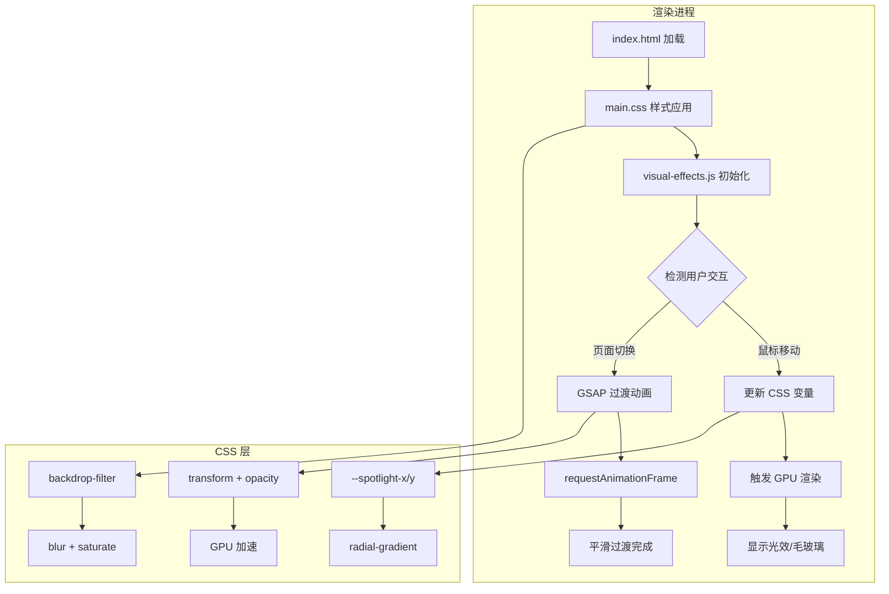

# 高级感视觉效果实施方案

本文档详细描述如何将三个核心"高级感"视觉技巧集成到废壳韵脚生成器项目中。

---

## 1. 方案概述

### 1.1 目标
将以下三个高级视觉效果集成到现有 Electron 应用中：
- **A. 完美毛玻璃效果 (Glassmorphism)** - 提升界面层次感
- **B. 智能光效跟随 (Spotlight Effect)** - 增加交互反馈
- **C. 窗口无缝过渡** - 优化页面切换体验

### 1.2 当前状态分析

| 效果 | 现有实现 | 改进空间 |
|------|----------|----------|
| 毛玻璃 | Modal 有 `backdrop-filter: blur(4px)` | `.panel` 和 `.shell` 可增强 |
| 光效跟随 | 无 | 需要新增 |
| 过渡动画 | GSAP 基础动画 | 可增强惯性效果 |

### 1.3 文件变更清单

```text
新增文件:
├── scripts/visual-effects.js    # 视觉效果控制模块

修改文件:
├── styles/main.css              # 添加毛玻璃和光效 CSS 变量
├── index.html                   # 引入新模块
└── scripts/app.js               # 初始化视觉效果
```

---

## 2. 技术实现细节

### 2.1 A. 完美毛玻璃效果 (Glassmorphism)

#### CSS 变量定义
在 `styles/main.css` 的 `:root` 中添加：

```css
:root {
  /* 现有变量保持不变 */
  
  /* 新增：毛玻璃效果变量 */
  --glass-bg: rgba(17, 24, 39, 0.75);
  --glass-blur: 20px;
  --glass-saturate: 180%;
  --glass-border: rgba(255, 255, 255, 0.08);
  --glass-highlight: rgba(255, 255, 255, 0.05);
}
```

#### .shell 容器增强
```css
.shell {
  width: min(1000px, 100%);
  /* 毛玻璃核心属性 */
  background: var(--glass-bg);
  backdrop-filter: blur(var(--glass-blur)) saturate(var(--glass-saturate));
  -webkit-backdrop-filter: blur(var(--glass-blur)) saturate(var(--glass-saturate));
  /* 高光边框 */
  border: 1px solid var(--glass-border);
  border-top: 1px solid var(--glass-highlight);
  border-radius: var(--radius);
  box-shadow: 
    0 30px 80px rgba(0, 0, 0, 0.35),
    inset 0 1px 0 var(--glass-highlight);
  overflow: hidden;
}
```

#### .panel 卡片增强
```css
.panel {
  /* 毛玻璃效果 */
  background: rgba(17, 24, 39, 0.6);
  backdrop-filter: blur(12px) saturate(150%);
  -webkit-backdrop-filter: blur(12px) saturate(150%);
  border: 1px solid var(--glass-border);
  border-radius: calc(var(--radius) - 4px);
  padding: 20px;
  position: relative;
  overflow: hidden;
  /* 为光效跟随预留 CSS 变量 */
  --spotlight-x: 50%;
  --spotlight-y: 50%;
}

/* 移除原有的 ::before 渐变，改用动态光效 */
.panel::before {
  content: "";
  position: absolute;
  inset: 0;
  background: radial-gradient(
    600px circle at var(--spotlight-x) var(--spotlight-y),
    rgba(124, 58, 237, 0.15),
    transparent 40%
  );
  pointer-events: none;
  opacity: 0;
  transition: opacity 0.3s ease;
}

.panel:hover::before {
  opacity: 1;
}
```

---

### 2.2 B. 智能光效跟随 (Spotlight Effect)

#### 核心 JavaScript 逻辑
创建 `scripts/visual-effects.js`：

```javascript
/**
 * 视觉效果控制模块
 * @module visual-effects
 */

const VisualEffects = (function() {
  'use strict';

  /**
   * 初始化光效跟随效果
   * @param {string} selector - 目标元素选择器
   */
  function initSpotlight(selector = '.panel') {
    const elements = document.querySelectorAll(selector);
    
    elements.forEach(el => {
      el.addEventListener('mousemove', handleMouseMove);
      el.addEventListener('mouseleave', handleMouseLeave);
    });
  }

  /**
   * 处理鼠标移动事件
   * @param {MouseEvent} e 
   */
  function handleMouseMove(e) {
    const rect = this.getBoundingClientRect();
    const x = e.clientX - rect.left;
    const y = e.clientY - rect.top;
    
    // 使用 requestAnimationFrame 优化性能
    requestAnimationFrame(() => {
      this.style.setProperty('--spotlight-x', `${x}px`);
      this.style.setProperty('--spotlight-y', `${y}px`);
    });
  }

  /**
   * 处理鼠标离开事件
   */
  function handleMouseLeave() {
    // 重置到中心位置
    this.style.setProperty('--spotlight-x', '50%');
    this.style.setProperty('--spotlight-y', '50%');
  }

  /**
   * 初始化边框光晕效果（可选增强）
   * @param {string} selector 
   */
  function initBorderGlow(selector = '.panel') {
    const elements = document.querySelectorAll(selector);
    
    elements.forEach(el => {
      // 创建光晕边框容器
      const glowBorder = document.createElement('div');
      glowBorder.className = 'glow-border';
      el.style.position = 'relative';
      el.appendChild(glowBorder);
      
      el.addEventListener('mousemove', (e) => {
        const rect = el.getBoundingClientRect();
        const x = e.clientX - rect.left;
        const y = e.clientY - rect.top;
        
        glowBorder.style.setProperty('--glow-x', `${x}px`);
        glowBorder.style.setProperty('--glow-y', `${y}px`);
      });
    });
  }

  // 公开 API
  return {
    initSpotlight,
    initBorderGlow,
    init: function() {
      initSpotlight('.panel');
      // initBorderGlow('.panel'); // 可选：启用边框光晕
    }
  };
})();

// 导出模块
if (typeof window !== 'undefined') {
  window.VisualEffects = VisualEffects;
}
```

#### 边框光晕 CSS（可选增强）
```css
.glow-border {
  position: absolute;
  inset: -1px;
  border-radius: inherit;
  pointer-events: none;
  background: radial-gradient(
    300px circle at var(--glow-x, 50%) var(--glow-y, 50%),
    rgba(124, 58, 237, 0.4),
    transparent 50%
  );
  mask: 
    linear-gradient(#fff 0 0) content-box, 
    linear-gradient(#fff 0 0);
  mask-composite: xor;
  -webkit-mask-composite: xor;
  padding: 1px;
  opacity: 0;
  transition: opacity 0.3s ease;
}

.panel:hover .glow-border {
  opacity: 1;
}
```

---

### 2.3 C. 窗口无缝过渡

#### 增强 GSAP 动画配置
在 `index.html` 的 GSAP 初始化部分添加：

```javascript
// 页面切换动画配置
const pageTransition = {
  // 进入动画
  enter: {
    opacity: 0,
    y: 30,
    scale: 0.98,
    duration: 0.5,
    ease: "power3.out"
  },
  // 离开动画
  leave: {
    opacity: 0,
    y: -20,
    scale: 1.02,
    duration: 0.3,
    ease: "power2.in"
  }
};

// 惯性滚动效果
function initInertiaScroll() {
  let velocity = 0;
  let targetY = 0;
  let currentY = 0;
  const friction = 0.92;
  const sensitivity = 0.5;
  
  const container = document.querySelector('.shell');
  
  container.addEventListener('wheel', (e) => {
    velocity += e.deltaY * sensitivity;
  }, { passive: true });
  
  function animate() {
    velocity *= friction;
    currentY += velocity;
    
    // 边界限制
    const maxScroll = container.scrollHeight - container.clientHeight;
    currentY = Math.max(0, Math.min(currentY, maxScroll));
    
    if (Math.abs(velocity) > 0.1) {
      container.scrollTop = currentY;
    }
    
    requestAnimationFrame(animate);
  }
  
  animate();
}
```

#### Modal 过渡增强
```css
.modal-overlay {
  /* 现有样式 */
  backdrop-filter: blur(8px) saturate(150%);
  -webkit-backdrop-filter: blur(8px) saturate(150%);
}

.modal {
  /* 增强过渡效果 */
  transform: translateY(30px) scale(0.95);
  transition: 
    transform 0.4s cubic-bezier(0.16, 1, 0.3, 1),
    opacity 0.3s ease;
}

.modal-overlay.active .modal {
  transform: translateY(0) scale(1);
}
```

---

## 3. 集成步骤

### 3.1 修改 index.html
在 `</body>` 前添加脚本引用：

```html
<script src="scripts/visual-effects.js" defer></script>
```

### 3.2 修改 scripts/app.js
在 `init()` 函数末尾添加：

```javascript
// 初始化视觉效果
if (window.VisualEffects) {
  window.VisualEffects.init();
}
```

### 3.3 更新 styles/main.css
按照上述 CSS 代码更新相应的样式规则。

---

## 4. 架构流程图



---

## 5. 性能优化建议

### 5.1 GPU 加速
确保以下属性触发 GPU 合成层：
```css
.panel {
  will-change: transform, opacity;
  transform: translateZ(0);
}
```

### 5.2 事件节流
对于高频事件使用 `requestAnimationFrame`：
```javascript
let ticking = false;
element.addEventListener('mousemove', (e) => {
  if (!ticking) {
    requestAnimationFrame(() => {
      updateSpotlight(e);
      ticking = false;
    });
    ticking = true;
  }
});
```

### 5.3 条件降级
检测低性能设备并禁用复杂效果：
```javascript
const prefersReducedMotion = window.matchMedia(
  '(prefers-reduced-motion: reduce)'
).matches;

if (!prefersReducedMotion) {
  VisualEffects.init();
}
```

---

## 6. 兼容性说明

| 特性 | Chrome | Firefox | Safari | Edge |
|------|--------|---------|--------|------|
| backdrop-filter | ✅ 76+ | ✅ 103+ | ✅ 9+ | ✅ 79+ |
| CSS 变量 | ✅ 49+ | ✅ 31+ | ✅ 9.1+ | ✅ 15+ |
| will-change | ✅ 36+ | ✅ 36+ | ✅ 9.1+ | ✅ 79+ |

由于本项目运行在 Electron 环境（Chromium 内核），以上特性均完全支持。

---

## 7. 预期效果

实施完成后，应用将具备：
1. **毛玻璃面板** - 半透明背景配合模糊效果，层次分明
2. **动态光效** - 鼠标悬停时卡片内部出现跟随光晕
3. **流畅过渡** - 页面切换和 Modal 弹出带有惯性动画
4. **性能优化** - 使用 GPU 加速和事件节流，保持 60fps

---

## 8. 下一步行动

1. 切换到 **Code 模式** 实施上述方案
2. 创建 `scripts/visual-effects.js` 文件
3. 更新 `styles/main.css` 添加毛玻璃和光效样式
4. 修改 `index.html` 引入新模块
5. 在 `scripts/app.js` 中初始化视觉效果
6. 测试并优化性能
