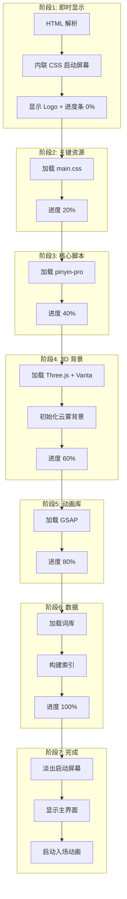

# 启动屏幕与进度条优化方案

## 问题分析

### 当前加载流程
1. **Electron 窗口创建** - `main.js:121-151` 设置 `show: false`，等待 `ready-to-show`
2. **HTML 解析** - 加载多个外部 CDN 资源
3. **Vanta 3D 背景初始化** - `index.html:260-296` 在 DOMContentLoaded 时执行
4. **GSAP 动画启动** - `index.html:306-351` 在 load 事件时执行
5. **应用初始化** - `scripts/app.js:372-503` 加载 pinyin-pro 和词库

### 卡顿原因
- Three.js 约 600KB + Vanta.js 约 50KB 同步加载
- GSAP 约 60KB + ScrollTrigger 约 20KB 同步加载
- 词库 JSON 解析和索引构建占用主线程
- 多个动画同时启动导致帧率下降

## 解决方案

### 核心思路
通过**启动屏幕 + 分阶段加载**来解决问题：
1. 在 DOM 最顶部插入轻量级启动屏幕
2. 将重型资源改为异步/延迟加载
3. 通过进度条反馈加载状态
4. 所有资源就绪后淡出启动屏幕

### 架构设计



## 实现细节

### 1. 启动屏幕 HTML 结构

在 `index.html` 的 `<body>` 最顶部添加：

```html
<!-- 启动屏幕 - 内联关键样式确保即时渲染 -->
<div id="splash-screen" style="
    position: fixed;
    inset: 0;
    z-index: 9999;
    background: #1b0d22;
    display: flex;
    flex-direction: column;
    align-items: center;
    justify-content: center;
    transition: opacity 0.5s ease, visibility 0.5s ease;
">
    <div class="splash-logo" style="
        font-size: 28px;
        font-weight: 700;
        color: #e2e8f0;
        margin-bottom: 32px;
        opacity: 0;
        animation: fadeInUp 0.6s ease forwards;
    ">废壳韵脚生成器</div>
    
    <div class="splash-progress-container" style="
        width: 200px;
        height: 4px;
        background: rgba(255,255,255,0.1);
        border-radius: 2px;
        overflow: hidden;
    ">
        <div id="splash-progress-bar" style="
            width: 0%;
            height: 100%;
            background: linear-gradient(90deg, #7c3aed, #22d3ee);
            border-radius: 2px;
            transition: width 0.3s ease;
        "></div>
    </div>
    
    <div id="splash-status" style="
        margin-top: 16px;
        font-size: 12px;
        color: #94a3b8;
    ">正在初始化...</div>
</div>

<style>
    @keyframes fadeInUp {
        from { opacity: 0; transform: translateY(10px); }
        to { opacity: 1; transform: translateY(0); }
    }
    
    #splash-screen.fade-out {
        opacity: 0;
        visibility: hidden;
    }
</style>
```

### 2. 进度控制器模块

创建 `scripts/splash-controller.js`：

```javascript
/**
 * 启动屏幕控制器
 * 管理加载进度和启动屏幕生命周期
 */
window.SplashController = (function() {
    const stages = {
        INIT: { progress: 0, message: '正在初始化...' },
        CSS_LOADED: { progress: 20, message: '加载样式...' },
        PINYIN_LOADED: { progress: 40, message: '加载拼音引擎...' },
        VANTA_LOADED: { progress: 60, message: '初始化 3D 背景...' },
        GSAP_LOADED: { progress: 80, message: '加载动画库...' },
        DICT_LOADED: { progress: 95, message: '加载词库...' },
        COMPLETE: { progress: 100, message: '准备就绪' }
    };
    
    let currentStage = 'INIT';
    
    const updateProgress = (stage) => {
        currentStage = stage;
        const { progress, message } = stages[stage];
        
        const progressBar = document.getElementById('splash-progress-bar');
        const statusText = document.getElementById('splash-status');
        
        if (progressBar) progressBar.style.width = progress + '%';
        if (statusText) statusText.textContent = message;
        
        console.log(`[Splash] ${stage}: ${progress}% - ${message}`);
    };
    
    const hide = () => {
        const splash = document.getElementById('splash-screen');
        if (splash) {
            splash.classList.add('fade-out');
            setTimeout(() => {
                splash.remove();
            }, 500);
        }
    };
    
    return {
        stages,
        updateProgress,
        hide,
        getCurrentStage: () => currentStage
    };
})();
```

### 3. 资源加载顺序优化

修改 `index.html` 底部脚本加载逻辑：

```html
<script>
    // 分阶段加载资源
    const loadScript = (src) => {
        return new Promise((resolve, reject) => {
            const script = document.createElement('script');
            script.src = src;
            script.onload = resolve;
            script.onerror = reject;
            document.head.appendChild(script);
        });
    };
    
    const initializeApp = async () => {
        try {
            // 阶段 1: CSS 已通过 link 标签加载
            SplashController.updateProgress('CSS_LOADED');
            
            // 阶段 2: 加载 pinyin-pro
            await loadScript('https://cdn.jsdelivr.net/npm/pinyin-pro@3.27.0/dist/index.js');
            SplashController.updateProgress('PINYIN_LOADED');
            
            // 阶段 3: 加载 Three.js + Vanta
            await loadScript('https://cdnjs.cloudflare.com/ajax/libs/three.js/r134/three.min.js');
            await loadScript('https://cdn.jsdelivr.net/npm/vanta@0.5.24/dist/vanta.fog.min.js');
            initVantaBackground();
            SplashController.updateProgress('VANTA_LOADED');
            
            // 阶段 4: 加载 GSAP
            await loadScript('https://cdnjs.cloudflare.com/ajax/libs/gsap/3.12.2/gsap.min.js');
            await loadScript('https://cdnjs.cloudflare.com/ajax/libs/gsap/3.12.2/ScrollTrigger.min.js');
            SplashController.updateProgress('GSAP_LOADED');
            
            // 阶段 5: 词库加载
            await DictManager.loadDict();
            SplashController.updateProgress('DICT_LOADED');
            
            // 完成
            SplashController.updateProgress('COMPLETE');
            
            // 延迟隐藏启动屏幕，让用户看到 100%
            setTimeout(() => {
                SplashController.hide();
                // 启动入场动画
                if (typeof gsap !== 'undefined') {
                    gsap.from('.shell', { y: 30, opacity: 0, duration: 0.8 });
                }
            }, 300);
            
        } catch (error) {
            console.error('[Splash] 加载失败:', error);
            document.getElementById('splash-status').textContent = '加载失败，请刷新重试';
        }
    };
    
    // DOM 就绪后开始加载
    document.addEventListener('DOMContentLoaded', initializeApp);
</script>
```

### 4. 主进程优化

修改 `main.js` 中的窗口显示逻辑：

```javascript
// 不再等待 ready-to-show，让启动屏幕先显示
win.loadFile('index.html');

// 立即显示窗口（启动屏幕会遮挡未加载完成的内容）
win.once('ready-to-show', () => {
    win.show();
});
```

## 预期效果

| 指标 | 优化前 | 优化后 |
|------|--------|--------|
| 首屏白屏时间 | 约 1-2 秒 | 约 100ms |
| 感知加载时间 | 无反馈，用户焦虑 | 有进度条，体验流畅 |
| 动画卡顿 | 多个动画同时启动 | 分阶段启动，无卡顿 |
| 主线程阻塞 | 词库解析阻塞 UI | 异步加载，不阻塞 |

## 实施步骤

1. [x] 分析当前项目加载流程和卡顿原因
2. [x] 设计初始化进度条方案
3. [ ] 创建启动屏幕 HTML 结构（内联在 index.html 顶部）
4. [ ] 添加启动屏幕 CSS 样式（内联关键样式）
5. [ ] 实现进度条控制器 JavaScript 模块
6. [ ] 修改资源加载顺序，分阶段报告进度
7. [ ] 优化 Vanta.js 和 GSAP 的延迟加载
8. [ ] 添加启动屏幕淡出动画
9. [ ] 测试并验证加载体验改善

## 注意事项

1. **内联关键样式**：启动屏幕的 CSS 必须内联，避免外部样式表加载延迟
2. **最小化启动屏幕 DOM**：只包含必要元素，减少首次渲染时间
3. **错误处理**：资源加载失败时显示友好提示
4. **降级方案**：如果 JavaScript 禁用，启动屏幕应自动隐藏
5. **性能监控**：保留 Performance API 标记，便于后续优化
